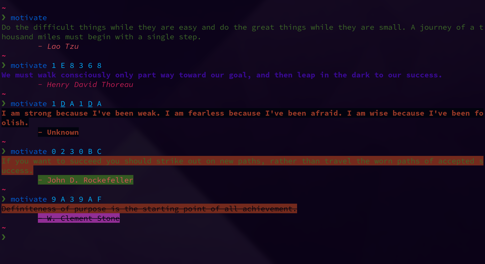

# Motivate

Gives u a motivational quote



```
Usage: motivate [-h] [quote_style author_style]
Formatting can be done by 3 separate digits - formatting_style foreground_color background_color
The quote and author style require 3 args each.

The default is: quote_style - 0 2 8 author_style - 3 B 8
Usage : $ motivate 0 2 8 3 B 8

The behaviour of formatting_style can vary based on the terminal emulator.

FORMATTING OPTIONS

	RESET         0
	BRIGHT        1
	DIM           2
	UNDERSCORE    3
	BLINK         4
	REVERSE       5
	HIDDEN        6
	HIGHLIGHT     7
	STRIKETHROUGH 9

COLOR OPTIONS - sourced from the terminal's theme (each color has a normal and a bright variant)

	BLACK         0   A
	RED           1   B
	GREEN         2   C
	YELLOW        3   D
	BLUE          4   E
	MAGENTA       5   F
	CYAN          6   G
	WHITE         7   H
	NOCOLOR       8       works only for background_color

```

For more details, checkout the SGR section : https://en.wikipedia.org/wiki/ANSI_escape_code

## Credits

### Quotes sourced from : 

* [mubaris/motivate](https://github.com/mubaris/motivate)
* [macalinao/motivate](https://github.com/macalinao/motivate)


